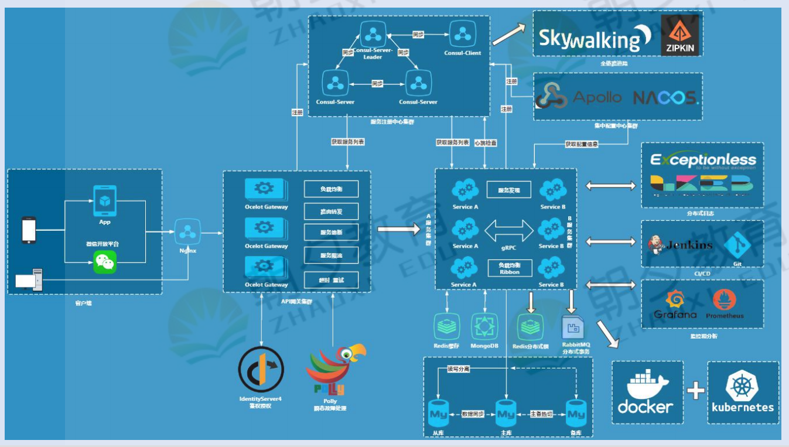
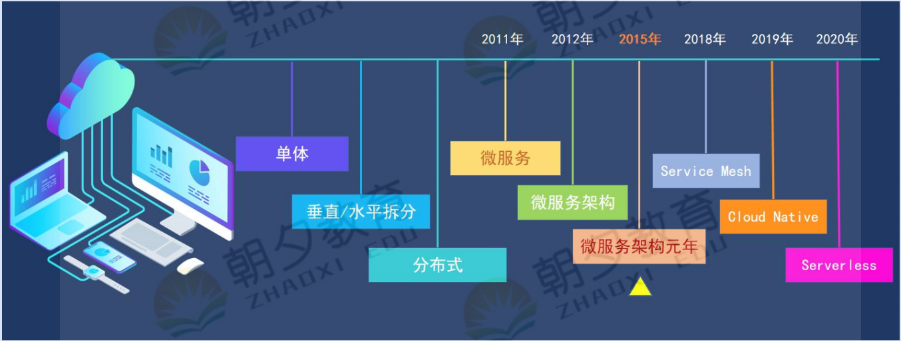
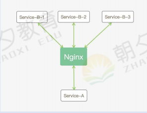
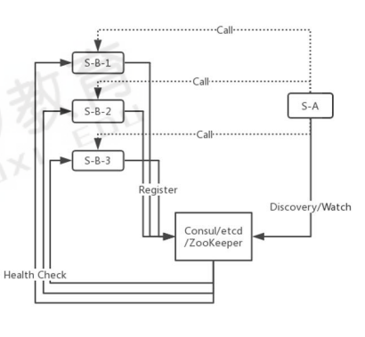
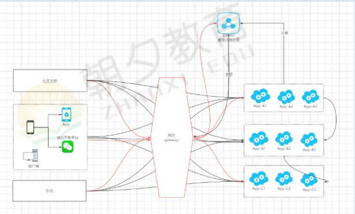
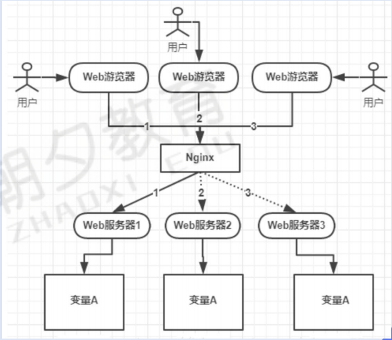
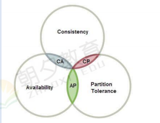
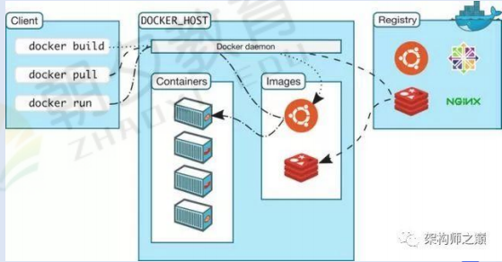
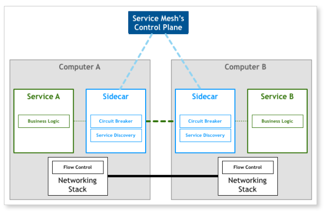

# 微服务架构长专题

## 一、认识微服务

### 1. 微服务架构编年史

### 2. 什么是微服务架构

微服务架构是再分布式技术来拆分业务逻辑，完成解耦的架构模式，并且包含一系列组件和方法论来解决落地问题。

### 3. 微服务的优点

- 易于开发和维护
- 单个服务启动快
- 局部修改易部署
- 技术栈不受限
- 按需伸缩

### 4. 微服务的缺点

- 运维成本高：更多的服务意味着更多的运维投入
- 可用性问题：服务的可用性：因为任意节点都是不可靠的，微服务会放大这个问题，一个节点故障，可能会引发雪崩问题。
- 数据一致性的问题

### 5. 微服务相关技术栈

**（1） 服务注册与发现**

​	Nginx：可以部署集群/负载均衡/水平扩展，但是不完美，因为它可以支持节点失效，但是不能自动感知新节点

​	consul：可以部署集群/负载均衡/水平扩展，也可以支持服务自动自动发现新服务。

**（2）网关**

- 统一入口：为全部微服务提供唯一入口点，网关起到内部和外部隔离，保障了后台服务的安全性。
- 鉴权校验：识别每个请求的 权限，拒绝不符合要求的请求。
- 动态路由：动态的将请求 路由 到不同的后端集群中。
- 降低耦合度：减少客户端与服务的 **耦合** ，服务可以独立发展。通过网关层来做映射
- 服务治理：重试-熔断-限流

**（3）全链路追踪 — SkyWalking**

**（4）分布式日志 — ELK**

**（5）分布式配置中心 — Apollo**

​		配置管理平台，能够集中化管理应用不同环境、不同集群的配置，配置修改后能够实时推送到应用端，并且具备规范的权限、流程治理等特性

**（6）分布式锁**

​	    定义：使用跨进程的互斥机制来控制共享资源的访问

**（7）分布式事务**

- 2PC/3PC 强一致性
- TCC/Saga弱一致性
- 本地消息表最终一致性

**（8）Docker**

​		定义：一个开源的应用容器引擎，可以打包应用以及依赖包到一个可移植的镜像中，然后发布到任何流行的 Linux或Windows 机器上，也可以实现虚拟化。

**（9）Kubernetes**

​	定义：编排容器，是管理应用的全生命周期的工具，从创建应用/部署，应用提供服务，扩容缩容，更新，都非常的方便，而且可以做到故障自愈。支持失效转移、快速伸缩、流量自适应、滚动发布、灰度发布。

**（10） CI/DI — Jenkins**

​	定义：Jenkins是一个开源的、提供友好操作界面的持续集成(CI)工具，主要用于持续、自动的构建/测试软件项目、监控外部任务的运行。

**（11）性能监控分析 — Prometheus+Grafana**

​	定义：Prometheus是由SoundCloud开发的开源监控报警系统和时序列数据库(TSDB)

​			  Grafana是一个开箱即用的可视化工具，具有功能齐全的度量仪表盘和图形编辑器，有灵活丰富的图形化选项，可以混	合多种风格，支持多个数据源特点。

###  6. 服务网格ServiceMesh

**（1）定义**

​	可以将它比作是应用程序或者说微服务间的 TCP/IP，负责服务之间的网络调用、限流、熔断和监控。对于编写应用程序来说一般无须关心 TCP/IP 这一层（比如通过 HTTP 协议的 RESTful 应用），同样使用 Service Mesh 也就无须关系服务之间的那些原来是通过应用程序或者其他框架实现的事情，比如 Spring Cloud、OSS，现在只要交给 Service Mesh 就可以了。

**（2）架构图**

**（3）特点**

- 应用程序间通讯的中间层
- 轻量级网络代理
- 应用程序无感知
- 解耦应用程序的重试/超时、监控、追踪和服务发现

### 7. 云原生CloudNative

### 8. 无服务架构Serverless

### 9. 数据中台

##  二、微服务组件之Consul

## 三、微服务组件之Ocelot

## 四、微服务组件之Polly

## 五、微服务组件之分布式链路追踪

