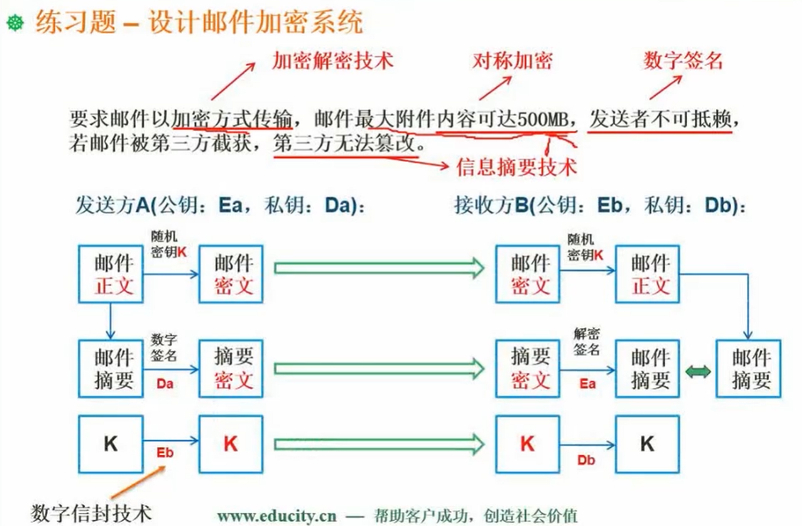

## 杂记

### 1. GRPC

### 2. MemoryCache

### 3. 数字签名

### 4. SSL与SSH

（1）SSL：Web安全基础

SSL是一种在线安全协议，提供数据[加密](https://so.csdn.net/so/search?q=加密&spm=1001.2101.3001.7020)，从而确保访问者的连接是安全的。

SSL的主要功能是：

- 数据加密

​	它的核心功能是维护服务器与客户端之间的通信。因此，它加密信息或数据的每一位，这些信息或数据只能由预期的接收者解锁。如果您的网站保存了敏感数据，例如ID，密码，付款信息等，则此SSL功能非常有用。

- 认证方式

​	SSL证书通过要求您进行身份验证过程来向您的网站提供身份验证。除非您完成彻底的验证过程，否则证书颁发机构将不会颁发SSL。因此，人们会信任您的网站

（2）SSH：种确保远程通信安全的方法

SSH协议（安全外壳）是一种确保从一台计算机到另一台计算机的远程通信安全的方法。它提供强大的身份验证，同时通过加密确保通信和完整性。

此安全协议通常用于访问类Unix的操作系统。但是，您也可以在Microsoft Windows上使用它。

SSH的主要功能是：

- 加密（SSH提供三种加密类型来保护通信安全）

对称加密：以这种加密形式，客户端和主机都在对消息进行加密和解密时使用秘密密钥。

非对称加密：在非对称加密中，使用两个单独的密钥进行加密和解密，称为公钥和私钥。这些密钥形成一个公共-私有密钥对。

散列：SSH还使用单向散列，这种形式的加密无法解密。每个输入都会生成一个固定长度的唯一值，该值没有明显的趋势，因此几乎不可能反转。

- 认证方式

SSH的另一个功能是提供身份验证。这些协议由三个不同的协议（即传输层，身份验证层和连接层）组成，它们对连接中的另一方进行身份验证。它会加密数据并在检查数据完整性时提供机密性。

（3）SSL与SSH区别

- SSH实现端口22，而SSL实现端口443。

- SSH可以帮助您安全地在Internet上执行命令，而SSL可以安全地传输关键信息。

- SSH在建立安全连接时需要密码验证系统。SSL不需要它。

- SSH主要处理网络隧道，而SSL处理证书。

